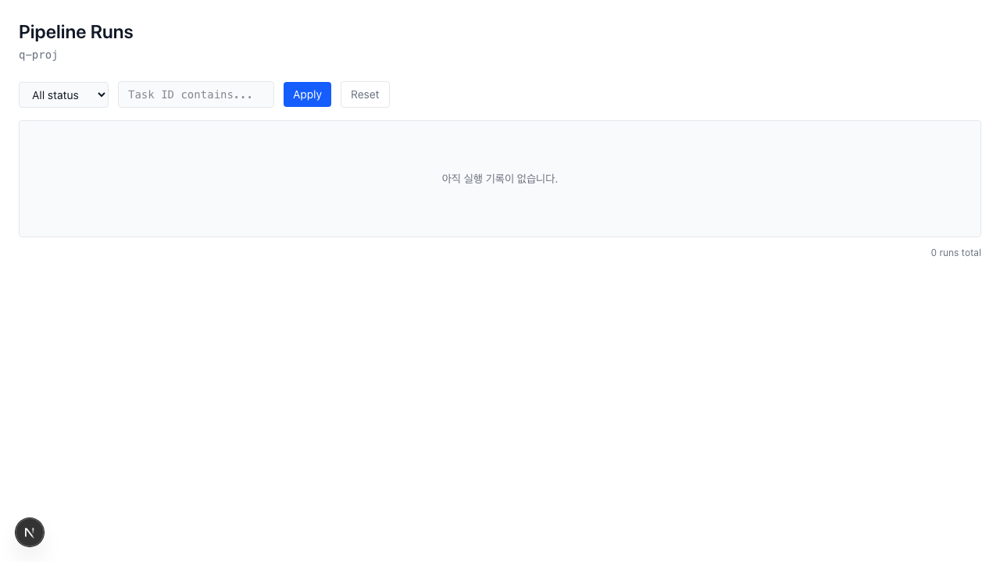

# AutoDev Agent

[](https://github.com/hyunlord/autodev-agent/actions/workflows/ci.yml)


AI coding agent orchestrator. Plan → Code → Verify pipeline automation. Works with Claude Code subscription — or `ANTHROPIC_API_KEY`.

---

## ✨ Key Differentiators

- **AI Builder** — Describe a pipeline in plain language; get a validated ADPL YAML back (819-char example generated at $0.018). No YAML knowledge required.
- **Cross-Model Verify** — The agent that wrote the code is never the agent that reviews it. Different LLM, different context. Average verify:cross score: ~97/100 (A grade).
- **ADPL DSL** — A 4,900-line pipeline specification with 7 node types and 4 trigger types. Schedule, webhook, event, and manual triggers. Define pipelines once, run anywhere.
- **Multi-Mode Coding** — Claude Code CLI (subscription), Claude SDK (API key), Codex CLI, Gemini CLI, Aider, Cline. Falls back automatically.
- **Zero External Dependency Streak** — 65+ consecutive commits without adding a new npm package. The footprint stays predictable.

---

## 🚀 Quick Start

### Prerequisites

- Node.js 20+
- pnpm
- One of the following (in preference order):
  - [Claude Code CLI](https://claude.ai/code) with an active subscription (recommended — no API key needed)
  - `ANTHROPIC_API_KEY` in your environment for SDK fallback

### Install

```bash
git clone https://github.com/hyunlord/autodev-agent.git
cd autodev-agent
cp .env.example .env   # add ANTHROPIC_API_KEY if not using Claude Code CLI
bash setup.sh
pnpm dev
```

Open http://localhost:3000

### First Task

1. Open the **Projects** view and create a project.
2. Click **AI Builder** in the sidebar.
3. Describe what your pipeline should do in plain language (e.g., "run npm audit every morning and post to Slack if there are vulnerabilities").
4. Review the generated ADPL YAML in the editor.
5. Click **Run** to execute the pipeline.
6. Check results in the **Pipeline Runs** view — logs, node statuses, and cost are shown per run.


---

## 🏗️ Architecture

```
User Task
    |
[Planning Agent]  <- claude-cli / codex / gemini
    |  plan
[Coding Agent]    <- claude-code-sdk + CLI fallback
    |  code + diff
[Verify Agent]    <- cross-model (different LLM)
    |
Result + Cost
```

**Verify Agent depth modes:**

| Mode | Mechanism | Approximate cost |
|------|-----------|-----------------|
| fast | Mechanical checks (lint, build, file existence) | $0.00 |
| standard | LLM judgment on diff + context | ~$0.02–0.06 |
| deep | Cross-model review (coding LLM ≠ verify LLM) | ~$0.04–0.10 |

The CLI-first / SDK-fallback architecture means the system uses your Claude Code subscription when the `claude` CLI is available, and switches to direct API calls only when it is not.



---

## 📊 Phase P Journey (v1.0)

| Stage | What | Deliverables |
|-------|------|--------------|
| 1 | Foundation | 7 DB tables + 4,900-line ADPL spec + 25 types + 29 schemas |
| 2 | Engine Core | Compiler / Scheduler / Worker / Adapter |
| 3 | Leaf Adapters | shell / api / agent nodes |
| 4 | Flow Nodes | branch / loop / merge |
| 5 | Triggers + Expressions | 4 trigger types + 3-slot Hybrid expressions |
| 6 | Durability | Checkpoint + Resume + worktree isolation |
| 7 | UX Layer | Pipeline UI + AI Builder + YAML editor |

6 weeks, 7 stages, 14 design documents.

---

## 🎨 Core Features

### AI Builder

Converts a natural language description into a valid ADPL YAML pipeline. It uses intent classification (create / modify / clarify) and validates the output against the full Zod schema before returning it.

Example: the prompt "run npm audit every morning and notify Slack on failure" produces:

```yaml
name: daily-npm-audit
trigger:
  type: schedule
  cron: "0 9 * * *"
nodes:
  - id: audit
    type: shell
    command: npm audit --json
  - id: notify
    type: api
    url: ${{ env.SLACK_WEBHOOK_URL }}
    when: ${{ steps.audit.exit_code != 0 }}
```

Demonstrated: 819-char YAML, $0.018 generation cost.

### Verify Agent

Verification is depth-based, not all-or-nothing. Choose the level that fits the risk and budget of each task:

- **fast** — runs in milliseconds, catches mechanical failures
- **standard** — one LLM pass over the diff, catches logic errors
- **deep** — a second, different LLM reviews the output of the first (cross-model)

The cross-model design prevents the coding agent from rationalizing its own mistakes. This is the default for the `pnpm ship` release gate.

### ADPL Pipeline Language

ADPL (AutoDev Pipeline Language) is the YAML-based DSL that describes pipelines. Key properties:

- **7 node types**: shell, api, agent, branch, loop, merge, template
- **4 trigger types**: schedule (cron), webhook, event, manual
- **Hybrid expressions**: 3-slot `${{ }}` syntax supporting environment variables, step outputs, and computed values
- **Durability**: checkpoint and resume support for long-running pipelines
- **Worktree isolation**: each pipeline run gets its own git worktree

The full specification is in `docs/adpl-spec/v1.0.md` (4,900 lines). Zod schemas in `src/lib/adpl/schemas/` provide runtime validation. TypeScript types in `src/lib/adpl/types/` cover all 25 constructs.

---

## 📋 Roadmap

- **✅ v1.0 RC** — Phase P Stages 1–7 complete. AI Builder, cross-model verify, ADPL spec, pipeline UI, durability layer all shipped.
- **🟡 v1.0 Release** — Resolving known limitations below, adding end-to-end integration tests, publishing to npm.
- **🔮 v1.5+** — G3 persistent cross-session memory, AgentScorer connected to selectAgent, Arena mode executor, extended adapter library.

---

## ⚠️ Known Limitations

These are honest, documented issues as of v1.0 RC. See [docs/phase-p/stage-7-retro.md](docs/phase-p/stage-7-retro.md) for full details.

- **AI Builder — clarify intent**: Some `clarify` responses fail Zod schema validation. The UI falls back gracefully, but the response is occasionally malformed. Tracked as tech debt.
- **AI Builder — diff calculation**: The `modify` intent returns an empty diff object in some edge cases. The pipeline YAML is still generated; the diff preview is blank.
- **Arena mode**: The arena schema is registered and the UI entry point exists, but the executor is not implemented. Arena mode is effectively disabled in this release.
- **G3 persistent memory**: The G3 agent supports session-scoped context, but cross-session auto-context loading is not yet built. Planned for Phase P+.
- **AgentScorer — selectAgent**: Complexity scoring runs and produces values, but the output is not wired into the `selectAgent` decision function. Agent selection does not yet use complexity scores.

---

## 🤝 Contributing

See [CONTRIBUTING.md](CONTRIBUTING.md) for branch conventions, the `pnpm ship` release gate requirements, and the four-block response format expected in PRs.

All contributions must pass `pnpm ship` (build + typecheck + API health + UI health + verify:cross). The gate requires a score of 95+ (A grade) to allow commit and push.

---

## 📜 License

Copyright 2025–2026 Kwan Hyeon Park. All rights reserved.

See [LICENSE](LICENSE) for terms.
